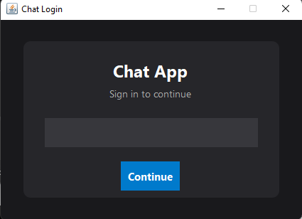
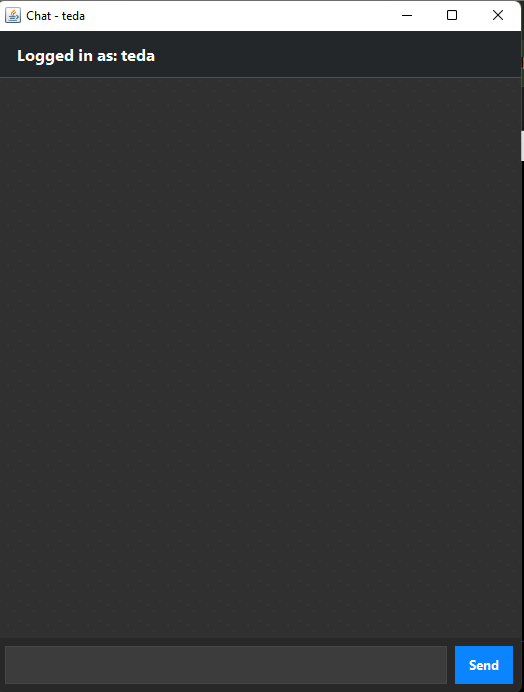
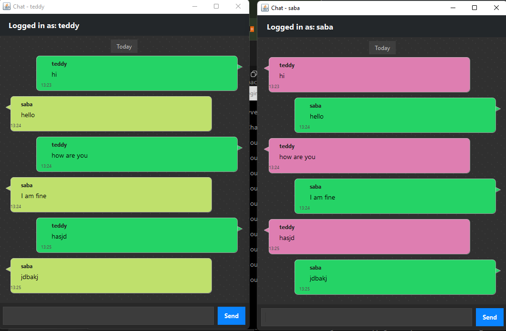

# Simple Java Chat Application

 

A real-time Java chat application with a graphical user interface (GUI) using sockets.  
This project includes:

- A **Login Window** for entering your username.  
- A **Chat Window** for real-time messaging between multiple clients.  
- A **Server** backend that handles multiple clients simultaneously.

The application demonstrates core Java concepts such as **socket programming**, **multithreading**, and **client-server architecture**, packaged in a user-friendly GUI.

---

## Features

| Feature | Description |
|---------|-------------|
| GUI Login Window | Enter your username to log in. |
| Chat Window | Styled message bubbles for easy reading. |
| Multiple Clients | Connect several clients to a single server. |
| Color-coded Messages | Each user has a unique color for their messages. |
| Timestamps | Messages include time sent. |
| Smooth Scrolling | Auto-scrolls to the latest message. |
| Date Separators | Messages are grouped by date. |

---

## Screenshots

**Login Screen**  


**Chat Window**  


**Multiple Clients Messaging**  


---

## Tech Stack

- **Language:** Java 18  
- **GUI:** Swing (Java built-in)  
- **Networking:** Java Sockets  
- **Multithreading:** Java Threads  

---

## Requirements

- Java Development Kit (JDK) 18 or higher  
- No external libraries required  

---

## Installation & Running

Clone the repository:

```bash
git clone https://github.com/tedacodder/chatapp-using-java.git
cd chatapp-using-java
```


### Compile the Project

Compile all Java source files:

```bash
javac -d bin src/server/*.java src/client/*.java src/client/ui/*.java
```

---

### Start the Server

Run the server backend:

```bash
java -cp bin server.ServerMain
```

---

### Start a Client

Launch the client application (Login UI):

```bash
java -cp bin client.ui.LoginWindow
```

> Repeat this step to connect multiple clients to the server.

---

## Configuration

- **Default server port:** `5000`
- The port can be modified in `ChatClient.java` and `Chatserver.java`

---

## Project Structure

```
src/
  server/
    ServerMain
    ChatServer.java           # Server backend handling multiple clients
  client/
    ChatClient.java           # Handles client-side socket communication
    ClientReaderThread.java   # Reads messages from server in a separate thread
    ui/
      LoginWindow.java        # Login GUI
      ChatWindow.java         # Main chat GUI window
```

---

## Contributing

Contributions are welcome.

To contribute:

1. Fork the repository
2. Create your feature branch:
   ```bash
   git checkout -b feature/NewFeature
   ```
3. Commit your changes:
   ```bash
   git commit -m "Add new feature"
   ```
4. Push to the branch:
   ```bash
   git push origin feature/NewFeature
   ```
5. Create a Pull Request

